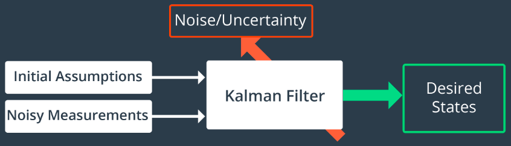
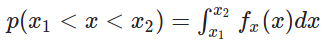
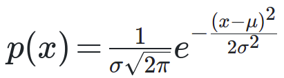
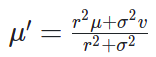
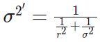

# Kalman Filter
In statistics and control theory, Kalman filtering, also known as linear quadratic estimation (LQE), is an algorithm that uses a series of measurements observed over time, containing statistical noise and other inaccuracies, and produces estimates of unknown variables that tend to be more accurate than those based on a single measurement alone, by estimating a joint probability distribution over the variables for each timeframe. (Source-Wikipedia)

*Rudolf E. Kálmán*
 

The filter is named after Rudolf E. Kálmán, who was one of the primary developers of its theory.

## Algorithm

### Gaussian
At the basis of the Kalman Filter is the Gaussian distribution, sometimes referred to as a bell curve or normal distribution. After a movement or a measurement update, it outputs a unimodal Gaussian distribution. This is its best guess at the true value of a parameter.
A Gaussian distribution is a probability distribution, which is a continuous function. The probability that a random variable, x, will take a value between x1 and x2 is given by the integral of the function from x1 to x2.  

### Mean and Variance
A Gaussian is characterized by two parameters - its mean (μ) and its variance (σ²). The mean is the most probable occurrence and lies at the centre of the function, and the variance relates to the width of the curve. The term unimodal implies a single peak present in the distribution.

The formula for the Gaussian distribution,  

*Measurment Update*

*Calculate Posterior Mean*

*Calculate Posterior Vairance*

The two Gaussians provide us with more information together than either Gaussian offered alone. As a result, our new state estimate is more confident than our prior belief and our measurement. This means that it has a higher peak and is narrower. You can see this in the graph above.

### State Prediction
Posterior Mean, μ` = μ1 + μ2
 
Posterior Variance, σ2 = σ21 + σ22

## 1D Kalman Filter
- [1 Dimensional Kalman Filter in C++](1D_Kalman_Filter)

